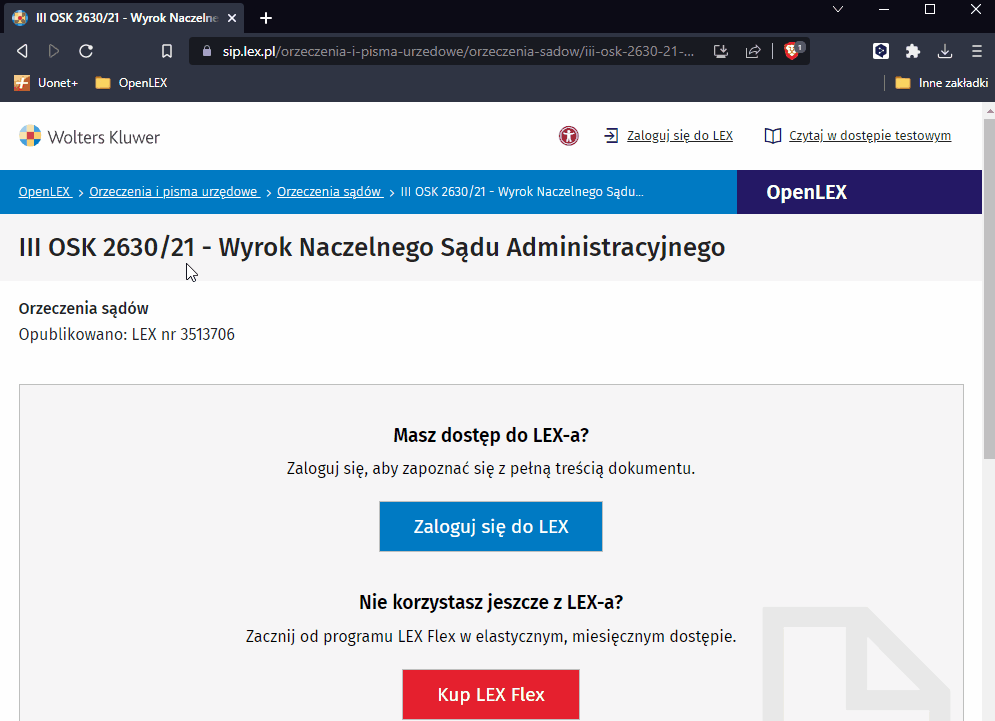

#  CBOSA-search
**Third-Party Google Chrome Extension (Plugin)**

Search for rulings by docket number in the Central Database of Judgements of [Polish] Administrative Courts (CBOSA) using a context menu.

[Wyszukuj orzeczenia po sygnaturze akt w Centralnej Bazie Orzeczeń Sądów Administracyjnych (CBOSA) używając menu kontekstowego.](https://github.com/HerrDiesel/CBOSA-search/blob/main/README.pl.md)

